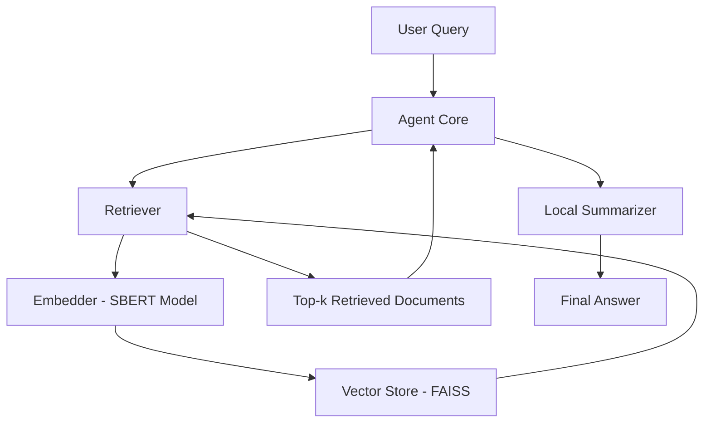
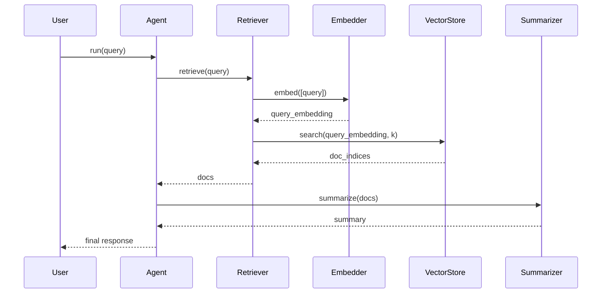

# Agentic AI RAG Demo (No API Key Required)

[]()
[]()
[](https://github.com/graccelle/agentic-ai-rag-demo)
[](https://github.com/graccelle/agentic-ai-rag-demo/commits/main)
[](https://github.com/psf/black)
[](LICENSE)
[](#streamlit-demo)

A lightweight demonstration of **agentic-style reasoning** combined with a simple **Retrieval-Augmented Generation (RAG)** pipeline,
implemented entirely with **local embeddings and vector search** (no external LLM or API keys required).

This repo is designed as a portfolio project to show:

- Agent-like reasoning over documents  
- Embedding & vector search (SBERT + FAISS)  
- Clean, modular Python code  
- A minimal Streamlit UI for interactive exploration  

---

## 🔧 High-Level Architecture Diagram



---

## 📜 UML Sequence Diagram (Agent + RAG)



---

## 🎯 Key Features

- **Agentic Core** – Simple agent orchestrator that decides: _retrieve → summarize_.  
- **RAG Components** – Embedder, vector store, and retriever built with `sentence-transformers` + `faiss`.  
- **Local Summarizer** – Deterministic, purely local heuristic summarizer (no external API).  
- **Streamlit UI** – Quick way to interact with the agent and inspect behavior.  

---

## 📁 Repository Structure

```text
agentic-ai-rag-demo/
│
├── README.md
├── requirements.txt
│
├── src/
│   ├── app.py                # CLI entrypoint
│   ├── rag/
│   │   ├── embedder.py       # Embedding model wrapper
│   │   ├── vector_store.py   # FAISS vector index
│   │   └── retriever.py      # Retrieval logic
│   └── agent/
│       ├── agent_core.py     # Orchestrating "agent"
│       └── tools.py          # Local summarizer tool
│
├── streamlit_app/
│   └── app.py                # Streamlit UI
│
├── data/
│   └── sample_docs/
│       └── sample_1.txt
│
└── notebooks/
    └── demo.ipynb            # Walkthrough notebook
```

---

## 🛠️ Installation

```bash
pip install -r requirements.txt
```

---

## ▶️ CLI Demo

```bash
python src/app.py
```

---

## 🌐 Streamlit Demo

<a name="streamlit-demo"></a>

```bash
streamlit run streamlit_app/app.py
```

You will get a simple web UI where you can:
- Type a question  
- Run the local agent  
- See how relevant chunks are summarized  

---

## 🧪 What This Demonstrates

- Basic **agentic reasoning pattern**: break a task into retrieval + summarization.  
- A working **RAG pipeline**: embeddings → FAISS → top-k docs.  
- No reliance on external proprietary models – everything runs locally.  
- Engineering practices appropriate for a small but realistic ML prototype.  

---

## 🧑‍💻 Tech Stack

- Python 3.10+  
- [sentence-transformers](https://www.sbert.net/)  
- [FAISS](https://github.com/facebookresearch/faiss)  
- [Streamlit](https://streamlit.io/)  

---

## 📄 License

This project is licensed under the MIT License.

---

## 👤 Author

**Grace Babalola**  
GitHub: [@graccelle](https://github.com/graccelle)
